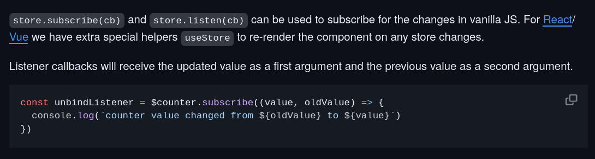
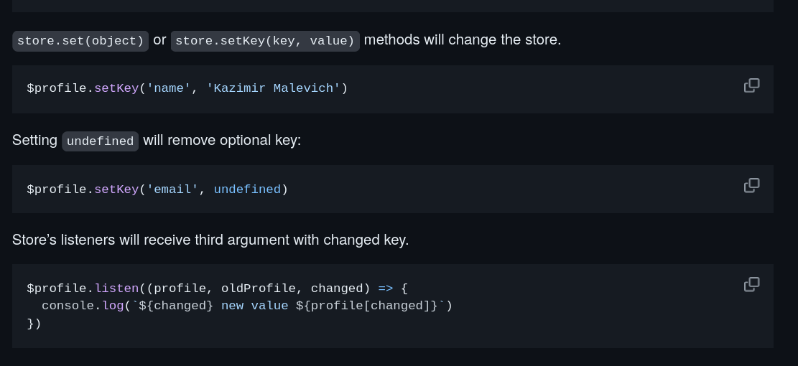

# Astro Playground

## 🚀 A place to rocket accelerate my exploration of astro

# Purpose

We use astro in Anemo AI as it enables to rapidly iterate and build web applications using Svelte and integrating UI component libraries from other frameworks such as React. We are not using React as it is not performant and we find that Svelte is easier to debug and write.

# Findings
### Rendering of UI intensive Components
I messed around with astro with an 11k page document from astro and realized that the rendering abilities of astro is serviceable and is suitable for most use cases. The rendering of the document was fast and the page was interactive. I was able to scroll through the document without too much lag.

## Nanostores

### What I was looking for
I wanted to explore astro's ability to attach listeners to variables in list as I wanted to trigger an event when a variable in a list changes.

Relevant Pieces of Information:
- Attaching listeners to a single variable

- Maps are lists right? (We are getting close)

Questions: Can we add 